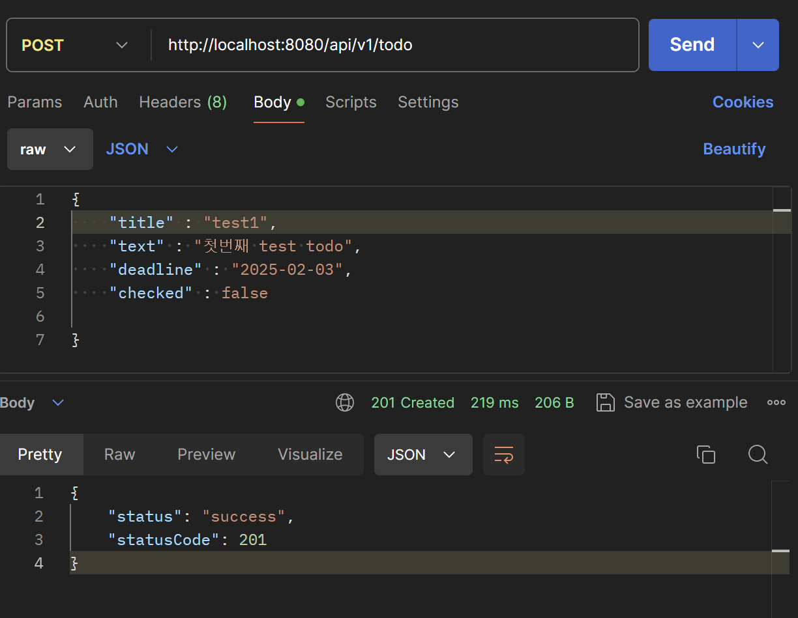

# 간단한 TODO앱 만들기
## API 설계서
- [11조 API 설계서](https://docs.google.com/document/d/1ZhgmqOzIX9GVAQreKAXtGEFtTm2EQwWxOI5_5r5dWB8/edit?tab=t.0)

 

## 실행 화면 (PostMan)
### 1. Todo 생성

### 2. Todo 1개 읽어오기

### 3. Todo 전체 읽어오기

### 4. Todo 수정
- 수정

    

- 수정 후 읽어온 결과

    

### 5. Todo 삭제
- 삭제

    

- 삭제 후 결과 (test1 사라짐)

    
